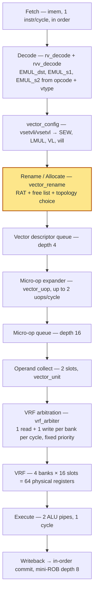
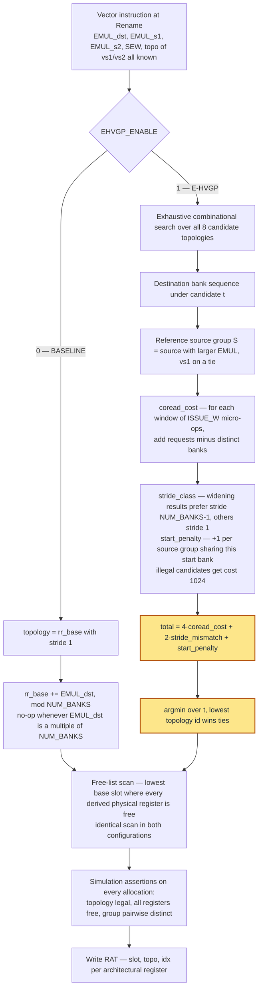
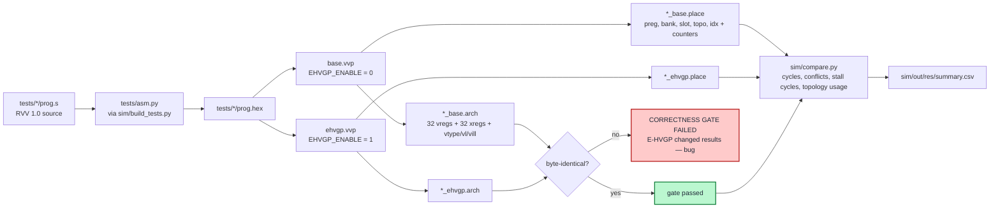

# E-HVGP — EMUL-Driven Heterogeneous Vector-Group Placement

A research prototype of a RISC-V Vector (RVV 1.0) core built to test one
question:

> If the core chooses a **different physical VRF-bank placement topology per
> vector register group**, driven by the EMUL/LMUL/SEW structure of the
> instruction that produces it, do bank conflicts on mixed-width operations
> go down?

The machine is instrumented so the question is answered by measurement, not
argument: the same core builds in two configurations that differ in exactly
one module, runs the same programs, and is required to produce byte-identical
architectural results while placing registers differently.

**Current answer: no — v1 of the mechanism does not beat the baseline.** The
result is negative, reproducible, and the cause is isolated to a design
constraint rather than a coding defect. See [Results](#results) and
[`docs/results.md`](docs/results.md) §5.

Plain **Verilog-2001** only. Xcelium is the primary simulator; Vivado is the
synthesis target.

---

## Table of contents

- [The problem](#the-problem)
- [The two configurations](#the-two-configurations)
- [Pipeline](#pipeline)
- [How placement is chosen](#how-placement-is-chosen)
- [Topology encoding](#topology-encoding)
- [Quick start](#quick-start)
- [How the A/B experiment works](#how-the-ab-experiment-works)
- [Results](#results)
- [Repository layout](#repository-layout)
- [What is not implemented](#what-is-not-implemented)
- [Documentation](#documentation)

---

## The problem

Mixed-width RVV instructions produce register groups of *different effective
sizes* from the same instruction stream. A widening op at `LMUL=m` writes a
`2m`-register group while reading `m`-register groups; a narrowing op reads a
`2m`-register group while writing an `m`-register group.

Under a single fixed bank-interleave scheme, groups of different shapes tend
to land on the same banks at the same time, because the interleave was chosen
for one canonical group shape and every group is forced through it. The
resulting contention is **structural** — a property of the EMUL/LMUL
relationship — not statistical and not history-driven.

The hypothesis: `EMUL`, `LMUL` and `SEW` are all known at **rename time**
from the encoding plus the current `vtype`, so the core can *deterministically*
place each group to avoid the collision, instead of *predicting* conflicts
from runtime history.

---

## The two configurations

`EHVGP_ENABLE` is threaded from `rv_core` to exactly one module,
[`rtl/e_hvgp/ehvgp_allocator.v`](rtl/e_hvgp/ehvgp_allocator.v), and nowhere
else.

| | `EHVGP_ENABLE = 0` — BASELINE | `EHVGP_ENABLE = 1` — E-HVGP |
|---|---|---|
| topology | `(rr_base, stride 1)` | `argmin` of a structural cost function |
| state | `rr_base += EMUL_dst` per allocation | none — pure function of rename-time state |
| inputs | allocation order | `EMUL_dst`, `EMUL_s1`, `EMUL_s2`, `SEW`, `topo(vs1)`, `topo(vs2)` |
| runtime occupancy input | no | no |

The baseline is deliberately not a strawman — for group sizes coprime with
`NUM_BANKS` it spreads successive groups evenly. Its known degeneracy is that
when `EMUL_dst ≡ 0 (mod NUM_BANKS)` the rotation is a **no-op**, which is
precisely the case E-HVGP was built to fix.

Everything else — ISA, micro-op model, VRF, bank count, bandwidth,
arbitration, execution units, free-list search — is identical between the two
builds, and that identity is checked by counters on every run.

---

## Pipeline

In-order issue, in-order commit, out-of-order completion between the two
slots. The placement decision happens at Rename and nothing downstream knows
which policy produced it.



The **architectural grouping** (`EMUL_*`, computed in `rvv_decode.v`) and the
**physical placement** (`rtl/e_hvgp/`) are kept strictly separate. RVV defines
the former and says nothing about the latter; the latter is entirely a
microarchitectural choice, which is what makes it available as an experimental
variable.

Placement is chosen for the **destination group only**. A physical register's
bank is fixed when it is allocated as a destination, so source groups were
already placed when *they* were destinations and cannot be moved
retroactively.

---

## How placement is chosen



Selection is fully deterministic: identical inputs always produce identical
output. Legality is checked **structurally** by pairwise bank comparison in
`f_topo_legal()`, not by trusting the `gcd(stride, B) = 1` rule, so it stays
correct for any `NUM_BANKS`.

> **On SEW.** Under register-granularity banking a group holds `EMUL` physical
> registers regardless of `SEW`, so `SEW` influences placement *only* through
> EMUL. `sew_log2` is wired into the selector for completeness and waveform
> visibility but is structurally subsumed. That is a finding, not an omission.

---

## Topology encoding

A topology is a `(start_bank, stride)` pair, with
`bank(i) = (start_bank + i · stride) mod NUM_BANKS`. Physical register
numbering is `preg = bank · REGS_PER_BANK + slot`, with
`slot_i = base_slot + (i div NUM_BANKS)` so that groups larger than the bank
count remain representable.

`NUM_TOPO = 2 · NUM_BANKS = 8`:

| id | start | stride | bank sequence, i = 0..3 |
|---|---|---|---|
| 0 | 0 | 1 | 0 1 2 3 |
| 1 | 1 | 1 | 1 2 3 0 |
| 2 | 2 | 1 | 2 3 0 1 |
| 3 | 3 | 1 | 3 0 1 2 |
| 4 | 0 | 3 | 0 3 2 1 |
| 5 | 1 | 3 | 1 0 3 2 |
| 6 | 2 | 3 | 2 1 0 3 |
| 7 | 3 | 3 | 3 2 1 0 |

Stride is a genuine second degree of freedom. For `G < NUM_BANKS` the two
strides give different bank **sets** — at `G=2, start=0`, `{0,1}` versus
`{0,3}`. For `G = NUM_BANKS` they give the same set in a different **order**,
which still matters because accesses are issued in index order in windows of
`ISSUE_W`.

Key parameters as built: `VLEN=128`, `NUM_VRF_BANKS=4`, `REGS_PER_BANK=16`,
`NUM_PHYS_VREGS=64` (2× rename ratio), `MAX_GROUP=8`, `ISSUE_W=2`,
`CMTQ_DEPTH=8`, `SEW` 8/16/32, `LMUL` 1/2/4/8.

---

## Quick start

Xcelium — the primary flow, all tests, both configurations:

```bash
./sim/run_xcelium.sh
```

Icarus Verilog — the local proof-of-correctness harness:

```powershell
.\sim\run_iverilog.ps1
```

Both harnesses assemble the test programs, build both configurations, run
every test, enforce the correctness gate and write
`sim/out/res/summary.csv`. `sim/compare.py` reprints the comparison from
existing result files without re-simulating:

```bash
python sim/compare.py
```

Single test, with waves and a per-allocation allocation trace:

```bash
./sim/run_xcelium.sh mixed gui
```

```powershell
.\sim\run_iverilog.ps1 -Test mixed -Wave
```

Driving a built simulation directly — plusargs are `+HEX`, `+NAME`, `+ARCH`,
`+PLACE`, `+MAXCYC`, `+TRACE`, `+WAVE`:

```bash
vvp sim/out/ehvgp.vvp +HEX=tests/mixed/prog.hex +TRACE +WAVE
```

Vivado out-of-context synthesis, same part and same constraints for both
configurations:

```bash
vivado -mode batch -source vivado/synth.tcl -tclargs 0
```

```bash
vivado -mode batch -source vivado/synth.tcl -tclargs 1
```

---

## How the A/B experiment works

Both configurations execute the *same* `prog.hex` from the *same* reset state.
Architectural equality is a hard gate; placement difference is the evidence
that the mechanism actually did something.



Four independent checks run on every regression:

1. **Architectural equivalence** — the `.arch` dumps must be byte-identical.
2. **Placement difference** — the `.place` dumps must differ, or the mechanism
   did nothing.
3. **In-RTL assertions** — on *every* allocation, `$fatal` if the chosen
   topology is illegal for the group size, if any register being allocated was
   not free, or if the group's registers are not pairwise distinct.
4. **Structural fairness counters** — `instructions`, `vector_instructions`,
   `vector_uops`, `vrf_read_requests`, `vrf_write_requests` must match between
   configurations, or the two builds are not running the same experiment.

The five tests are `same` (control, no EMUL mismatch), `widening` (the
mechanism-triggering case), `narrowing` (mirror case, highest read pressure),
`mixed` (groups of EMUL 2 and 4 alive together) and `stress` (four phases,
many shapes, 8 loop iterations). Details in
[`docs/verification.md`](docs/verification.md).

---

## Results

Icarus Verilog 12.0, 2026-08-14. Every number below comes from a simulation
output file; nothing is estimated or extrapolated. Full tables and analysis in
[`docs/results.md`](docs/results.md).

**Correctness gate: passed on all five tests.** Architectural state is
byte-identical between configurations everywhere, placement differs
everywhere, and no legality/freeness/distinctness assertion fired on any
allocation.

Performance — positive Δ means E-HVGP is worse:

| Test | cycles B → E | Δ | conflicts B → E | Δ | stall cycles B → E | Δ |
|---|---|---|---|---|---|---|
| `same` | 33 → 33 | 0.0% | 0 → 0 | — | 0 → 0 | — |
| `widening` | 43 → 43 | 0.0% | 26 → 27 | +3.8% | 17 → 18 | +5.9% |
| `narrowing` | 30 → 33 | **+10.0%** | 16 → 22 | +37.5% | 11 → 14 | +27.3% |
| `mixed` | 45 → 47 | **+4.4%** | 17 → 26 | +52.9% | 11 → 18 | +63.6% |
| `stress` | 465 → 475 | **+2.2%** | 368 → 321 | **−12.8%** | 230 → 262 | +13.9% |

### Why it fails, and why that is interesting

The measurements isolate the cause, and it is architectural rather than a bug.

**The predicted baseline degeneracy is real.** On `widening` the baseline
issues topology 0 for **12 of 12** allocations — `rr_base += 4` with `B = 4`
is a no-op, so every widening result lands on the same bank sequence. The
problem E-HVGP set out to solve exists and is measurable.

**E-HVGP v1 replaces one constant with a different constant.** On the same
test it picks topology 5 for **10 of 12** allocations. "Always `(0, stride 1)`"
becomes "always `(1, stride 3)`". Successive widening results still receive
identical bank sequences and still collide on every co-read. Tracing shows
`cost=8` for the winner on every allocation — all eight candidates tie, because
a 4-register destination group has period 4 while the 2-register reference
source has period 2, so every relative alignment yields the same total. The
winner is decided entirely by tie-breakers, which are constant for a
homogeneous instruction stream.

**The root cause is the v1 constraint.** A function of the form
`f(EMUL_dst, EMUL_s1, EMUL_s2, SEW, topo(vs1), topo(vs2))` is *constant across
instructions of the same shape with the same source topologies*. In any
homogeneous kernel or loop body — exactly the workloads that matter —
successive destination groups get identical placements and self-conflict.

| | distinguishes successive same-shape groups? | handles `EMUL_dst ≡ 0 mod B`? |
|---|---|---|
| Baseline — stateful rotation by `EMUL_dst` | yes, except when the increment ≡ 0 | **no** |
| E-HVGP v1 — pure structural function | **no, never** | n/a — it never rotates |

`stress` is the one workload where shapes vary enough for the structural
function to discriminate (it uses all 8 topologies; the baseline uses 4), and
there conflicts do drop 12.8% — yet cycles rise 2.2%. That is a metric
mismatch: `bank_conflict_count` counts denied *requests* while
`bank_stall_cycles` counts *cycles containing a denial*, and only the latter
maps onto lost time. **The v1 cost function optimises the wrong objective.**

The smallest proposed correction — give the selector one piece of
allocation-order state whose increment is structurally guaranteed never to be
`≡ 0 (mod NUM_BANKS)`, while still reading no runtime occupancy — **has not
been implemented.** It changes the research mechanism and requires sign-off
first. See [`docs/results.md`](docs/results.md) §6.

### Synthesis

**Not run.** Vivado is not installed on this machine, so no LUT/FF/BRAM/DSP
or Fmax numbers are claimed. The flow is in
[`vivado/synth.tcl`](vivado/synth.tcl) (out-of-context,
`-generic EHVGP_ENABLE=0|1`, `xc7a100tcsg324-1`, 100 MHz starting target).
Expected critical path when it is run: `topology_selector.v` is a fully
combinational exhaustive search over 8 candidates × 8 group indices sitting
inside the rename stage.

---

## Repository layout

```
rtl/common/      ehvgp_defs.vh, ehvgp_funcs.vh    placement functions
rtl/core/        rv_core.v, imem.v
rtl/decode/      rv_decode.v, rvv_decode.v
rtl/rename/      vector_rename.v                  RAT + free list + allocator
rtl/vector/      vector_config.v, vector_uop.v, vector_alu.v, vector_unit.v
rtl/vrf/         vrf.v, vrf_bank.v, vrf_arbiter.v
rtl/e_hvgp/      topology_table.v, bank_mapper.v,
                 topology_selector.v, ehvgp_allocator.v
tb/              tb_top.v
tests/           asm.py + same/ widening/ narrowing/ mixed/ stress/
sim/             filelist.f, run_xcelium.sh, run_iverilog.ps1,
                 build_tests.py, compare.py
vivado/          synth.tcl, constraints.xdc
docs/            architecture.md, ehvgp.md, verification.md, results.md
```

`rtl/e_hvgp/` is structurally separable from `rtl/vrf/`: the baseline VRF is
complete and verifiable standalone, and E-HVGP is layered on as an addition
rather than a rewrite.

Two notes on that directory. `ehvgp_allocator.v` instantiates
`topology_selector.v` unconditionally in both configurations and selects
between its output and the round-robin pointer with a `generate` — so the
selector is present but unused in the baseline build.
`topology_table.v` and `bank_mapper.v` are compiled and synthesised but are
**not instantiated** anywhere; they document and encode the topology space
standalone, while the placement math the datapath actually executes lives in
the functions in `rtl/common/ehvgp_funcs.vh`, included directly into the
modules that need it.

---

## What is not implemented

Not in the ISA subset: `SEW=64`, fractional `LMUL`, masking, floating point,
reductions, gather/scatter, and **all memory operations**. `vill` is raised for
`SEW=64` and fractional `LMUL`; widening or narrowing at `LMUL=8` is rejected
because `EMUL=16` exceeds `MAX_GROUP`. The scalar side is a shim —
`LUI, ADDI, ADD, SUB, BNE, ECALL(=halt)` — present only so `vsetvli` has an
AVL source and the stress workload can loop. No caches, no MMU, no privileged
architecture, no data memory.

Untested rather than failing — no test currently fails:

1. **`VL < VLMAX`** — every shipped test runs at `VL = VLMAX`, so the
   documented tail-agnostic-with-computed-values deviation is never exercised.
2. **Physical register exhaustion** — the rename stall path exists and is
   taken under backpressure, but exhaustion-specific behaviour is unproven.
3. **`vsetvl` (register form)** — decoded and implemented, but every test uses
   `vsetvli`.
4. **`LMUL=8` directly** — `EMUL=8` groups are exercised via widening at
   `LMUL=4`, but no test sets `LMUL=8`.
5. **Recovery paths** — the machine is in-order and non-speculative, so the
   claim that `topology_id` recovers like any other rename field is true *by
   construction*, not verified.
6. **No random or constrained-random testing**, and **no RVV compliance
   suite.** This is the most significant gap: differential A/B testing proves
   the two configurations *agree with each other*, not that either implements
   RVV correctly.

Prototype-scale caveats: topology selection is combinational and exhaustive
(real silicon would need pipelining or a smaller candidate set), `ISSUE_W = 2`
is hard-coded in the `vector_unit.v` slot logic even though it is a parameter
elsewhere, and in-order issue means a real OoO scheduler would change absolute
conflict counts — though not the pipeline stage at which topology is chosen.

---

## Documentation

| Document | Contents |
|---|---|
| [`docs/architecture.md`](docs/architecture.md) | What is actually implemented — parameters, pipeline, RVV subset, RAT, free list, micro-op model, bank conflict model, counters |
| [`docs/ehvgp.md`](docs/ehvgp.md) | The mechanism spec — problem, baseline, v1 selector inputs, topology encoding, cost function, fairness argument, limitations |
| [`docs/verification.md`](docs/verification.md) | Test descriptions, the four checks, expected results, known gaps |
| [`docs/results.md`](docs/results.md) | Every measured number, the analysis of the negative result, and the open architectural issue |
